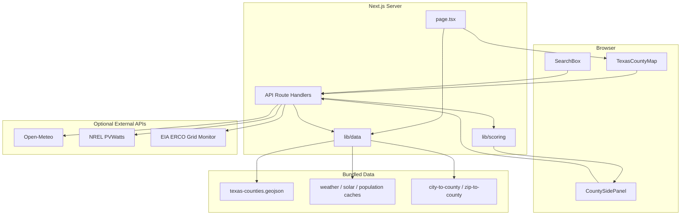

# GridSignal Texas

Texas county-level interactive map for backup energy planning priority using public weather, solar, demand, and grid strain data.

## Problem It Solves

Texas energy signals are spread across weather, solar, population, grid, and utility sources. GridSignal Texas combines them into one explainable county-level **Backup Priority Score** so users can see where backup planning may be worth evaluating—without outage prediction or professional advice claims.

## Demo

**Repository:** [https://github.com/ChimdumebiNebolisa/GridSignal](https://github.com/ChimdumebiNebolisa/GridSignal)

**Local run:**

```bash
npm install
cp .env.example .env.local
npm run dev
```

Open [http://localhost:3000](http://localhost:3000).

**What you will see:**

- Texas county map with 254 counties colored by Backup Priority Score
- Layer toggles for weather, solar, demand, and statewide grid strain
- County side panel with score breakdown, recommendation, utility context, and data quality labels
- Search by county, city, or ZIP
- Copy or download a plain-text county report

## Features

- Interactive Texas county map (254 counties) with no required external base map tiles
- Counties colored by Backup Priority Score or component layers
- Layer toggles: Backup Priority, Weather Risk, Solar Potential, Demand Exposure, Statewide Grid Strain
- County detail side panel with score breakdown, recommendation, utility context, and data quality
- Search by county name, city (~1,462 cities), or ZIP (~1,928 ZIPs); approximate matches are labeled
- Copy or download plain-text county report
- Deterministic scoring from public data with live, cached, estimated, and unavailable labels
- API routes: `/api/counties`, `/api/county/[fips]`, `/api/weather/[fips]`, `/api/solar/[fips]`, `/api/grid-strain`, `/api/search`

## Tech Stack

- Next.js 16 (App Router) + TypeScript
- Tailwind CSS
- React Leaflet / Leaflet
- Static GeoJSON and JSON data files
- Vitest for scoring and data validation tests
- No database, authentication, or payments

## Architecture



**Backup Priority Score formula:**

```text
0.30 × weather risk
+ 0.25 × solar potential
+ 0.25 × demand exposure
+ 0.20 × statewide grid strain
```

Scores are computed server-side. API keys stay in route handlers only and are never exposed to client components.

## Setup

1. Clone the repository:

```bash
git clone https://github.com/ChimdumebiNebolisa/GridSignal.git
cd GridSignal
```

2. Install dependencies:

```bash
npm install
```

3. Create local environment file:

```bash
cp .env.example .env.local
```

4. Add optional API keys to `.env.local`:

| Variable | Purpose |
|----------|---------|
| `NREL_API_KEY` | Live PVWatts solar fetches ([signup](https://developer.nrel.gov/signup/)) |
| `EIA_API_KEY` | Live ERCO grid strain ([register](https://www.eia.gov/opendata/register.php)) |
| `CENSUS_API_KEY` | Live Census population (static cache bundled by default) |
| `NEXT_PUBLIC_APP_NAME` | App title (default: GridSignal Texas) |

5. Verify the project:

```bash
npm run typecheck
npm run lint
npm run test
npm run build
```

6. Start the dev server:

```bash
npm run dev
```

## How to Use

1. Open the app and view the Texas county map (default layer: **Backup Priority**).
2. Use **Map layer** controls to recolor counties by weather, solar, demand, or statewide grid strain.
3. Click a county to open the side panel with the Backup Priority Score, breakdown, recommendation, and utility context.
4. Search for a county, city, or ZIP in the search box; select a result to focus that county.
5. Use **Copy report** or **Download .txt** to export a plain-text county summary.

## Key Technical Decisions

- **Precomputed weather cache** for all 254 counties keeps map and panel scores consistent; live weather is available via `/api/weather/[fips]`.
- **PVWatts** uses `developer.nlr.gov` with NREL fallback; static solar cache when keys or requests fail.
- **EIA ERCO** demand is normalized against a rolling min/max from the same hourly series; neutral `50` when unavailable.
- **No OSM tile dependency** — counties render from bundled GeoJSON on a plain background.
- **Utility context** is informational only and does not affect the score; uncertain counties use an empty utility list.
- **City/ZIP lookup** uses centroid spatial joins from public datasets; results labeled as approximate when applicable.

## Limitations

- Estimates **backup-planning priority**, not outage probability or household-level reliability.
- **Statewide grid strain** is balancing-authority level (ERCO), not county-specific grid reliability.
- **Likely utility/service territory** is context only—not a legal service-area determination.
- **City and ZIP** matches may be approximate; multi-county ZIPs are not fully resolved.
- Most counties have **unknown utility context** (no fabricated utility names).
- Missing API keys use cached or neutral estimated values, clearly labeled in the UI.
- Scores depend on available public data and documented normalization rules.

## License

MIT License
